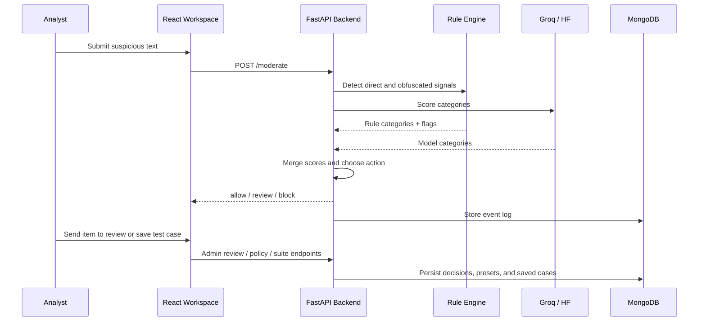
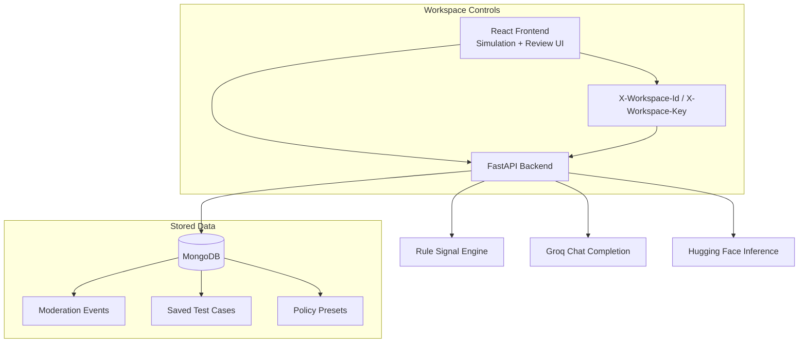

<div align="center">

# Text-Guard

**Hybrid AI + Rule-Based Moderation Workspace for Risky User Text**

<p align="center">
  <strong>Simulation Lab • Review Queue • Policy Presets • Regression Memory</strong>
</p>

<p align="center">
  
  
  
  
  
</p>
</div>

---

## Table of Contents

- [Overview](#-overview)
- [Core Features](#-core-features)
- [Product Flow](#-product-flow)
- [System Architecture](#-system-architecture)
- [Moderation Logic](#-moderation-logic)
- [Tech Stack](#-tech-stack)
- [Repository Structure](#-repository-structure)
- [Getting Started](#-getting-started)
- [Environment Variables](#-environment-variables)
- [API Surface](#-api-surface)
- [Workflow Notes](#-workflow-notes)
- [Deployment](#-deployment)
- [Troubleshooting](#-troubleshooting)
- [Author](#-author)

---

## Overview

**Text-Guard** is a moderation-focused full-stack workspace for evaluating risky user-generated text before it reaches production systems. It combines:

- a **rule-based signal layer** for direct abuse, spam, threats, and obfuscation,
- an **LLM moderation layer** using **Groq** (primary) and **Hugging Face** (fallback),
- a **review queue** for human follow-up and decision tracking.

---

## Core Features

| Feature | Description |
| --- | --- |
| Hybrid Moderation | Merges deterministic rule signals with LLM category scoring for stronger evasion detection. |
| Obfuscation Awareness | Detects spaced-out, symbol-swapped, and misspelled abusive language like `k y s` or `1d10t`. |
| Review Queue | Lets reviewers assign owners, add notes, and confirm moderation actions. |
| Simulation Lab | Test content, compare policy presets, and submit items to review from a single workspace. |
| Regression Memory | Saves moderation cases and imports/exports them as reusable suites. |
| Analytics Snapshot | Tracks moderation volume, top categories, and recent trends. |

---

## Product Flow



---

## System Architecture



---

## Moderation Logic

Text-Guard builds decisions from two parallel inputs:

1.  **Rule Signals**: Curated regex and canonicalization for direct slurs, threats, and obfuscated text.
2.  **LLM Scoring**: JSON-only analysis from Groq or Hugging Face.
3.  **Action Selection**: Merged scores vs thresholds (default: `REVIEW=0.45`, `BLOCK=0.85`).

---

## Tech Stack

- **Backend:** FastAPI, Uvicorn, Pydantic, pymongo, groq
- **Frontend:** React 19, React Router 7 (HashRouter), Vite
- **UI Utilities:** Framer Motion, Lucide React, Tailwind CSS

---

## Getting Started

### Prerequisites
- Python 3.10+, Node.js 18+
- MongoDB instance (e.g., MongoDB Atlas)
- Groq API key

### 1. Clone the Repository

```bash
git clone https://github.com/dheerajpapani/Text-Guard.git
cd Text-Guard
```

### 2. Backend Setup
```bash
cd backend
python -m venv .venv
# Activate venv: .venv\Scripts\activate (Win) or source .venv/bin/activate (Unix)
pip install -r requirements.txt
```
```bash
copy ..\.env.example ..\.env
uvicorn main:app --host 0.0.0.0 --port 8088 --reload
```

### 3. Frontend Setup
```bash
cd frontend
npm install
copy .env.example .env
npm run dev
```

---

## Environment Variables

### Backend `.env`
| Variable | Value/Description |
| --- | --- |
| `MONGO_URI` | MongoDB Atlas connection string |
| `GROQ_API_KEY` | Your Groq API Key |
| `CORS_ORIGINS` | `https://your-frontend-domain.com` |
| `APP_ENV` | `production` |

### Frontend `frontend/.env`
| Variable | Value/Description |
| --- | --- |
| `VITE_API_BASE_URL` | Your backend service URL |
| `VITE_WORKSPACE_ID` | Workspace identifier (default: `default`) |

---

## API Surface

### Public / Core

- `GET /` - service metadata
- `GET /health` - health check with provider availability
- `POST /moderate` - moderation decision for input text

### Admin / Workspace Features

- `GET /admin/logs`
- `POST /admin/review-submissions`
- `POST /admin/logs/{event_id}/decision`
- `POST /admin/logs/{event_id}/assign`
- `GET /admin/analytics`
- `GET /admin/test-cases`
- `POST /admin/test-cases`
- `GET /admin/test-cases/export`
- `POST /admin/test-cases/import`
- `GET /admin/policy-presets`
- `POST /admin/policy-presets`

### Example Moderation Request

```bash
curl -X POST http://localhost:8088/moderate ^
  -H "Content-Type: application/json" ^
  -H "X-Workspace-Id: default" ^
  -d "{\"text\":\"k y s you 1d10t\",\"mode\":\"comment\"}"
```

Example response shape:

```json
{
  "action": "block",
  "score": 0.92,
  "reason": "policy_harassment",
  "matched_seed": "kys",
  "categories": {
    "hate": 0.0,
    "harassment": 0.92,
    "sexual": 0.0,
    "violence": 0.0,
    "self_harm": 0.0,
    "spam": 0.0,
    "other": 0.0
  },
  "flags": ["obfuscated_threat"],
  "policy": {
    "block_threshold": 0.85,
    "review_threshold": 0.45
  },
  "provider": "groq",
  "model": "llama-3.1-8b-instant",
  "mode": "comment",
  "latency_ms": 123
}
```

---

## Workflow Notes

### Frontend Views

- **Simulation Lab**: analyze text, compare against policy presets, save cases, import/export suites, and submit items to review.
- **Review Queue**: filter by action or status, assign ownership, record reviewer notes, and apply final decisions.
- **Overview Dashboard**: inspect queue analytics, top flags, top categories, and recent event trend.

### Policy Presets

Policy presets are stored in MongoDB and can be edited from the frontend. The UI currently ships with default preset ideas such as:

- `balanced`
- `strict`

### Workspace Isolation

All frontend requests attach:

- `X-Workspace-Id`
- `X-Workspace-Key` when configured

This makes it possible to reuse one backend for multiple workspace contexts with isolated stored documents.

---

## Deployment

### Backend (Render)
1. **Root Directory**: `backend`
2. **Build Command**: `pip install -r requirements.txt`
3. **Start Command**: `uvicorn main:app --host 0.0.0.0 --port $PORT`

### Frontend (GitHub Pages)
1. Configure `VITE_API_BASE_URL` as a **GitHub Secret**.
2. Deploy automatically via the included **GitHub Action** (`.github/workflows/deploy.yml`).

---

## Troubleshooting

<details>
<summary><strong>The frontend loads, but review logs or analytics fail</strong></summary>

MongoDB is not optional for persistence features. Without `MONGO_URI`, moderation can still return responses, but log retrieval, analytics, saved cases, and policy preset storage will fail.
</details>

<details>
<summary><strong>Moderation works, but provider shows as <code>none</code> or <code>error</code></strong></summary>

Check `GROQ_API_KEY` or `HF_API_TOKEN`. If Groq is unavailable, the backend attempts Hugging Face. If neither is configured, the API falls back to rule-only behavior.
</details>

<details>
<summary><strong>Workspace requests return 401</strong></summary>

If `WORKSPACE_SHARED_KEY` is configured on the backend, the frontend or client must send the exact same value in `X-Workspace-Key` or `VITE_WORKSPACE_KEY`.
</details>

<details>
<summary><strong>The API says CORS is blocked locally</strong></summary>

Ensure `CORS_ORIGINS` includes the frontend origin, usually `http://localhost:5173` and `http://127.0.0.1:5173`.
</details>

---

## Author

Developed and maintained by **Dheeraj Papani**.

<a href="https://github.com/dheerajpapani">
  
</a>
<a href="https://www.linkedin.com/in/dheerajpapani">
  
</a>

