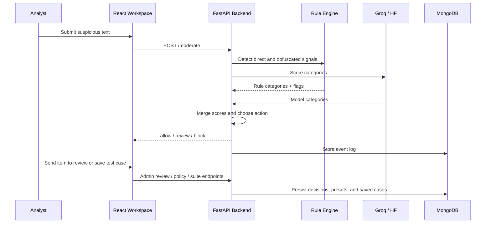
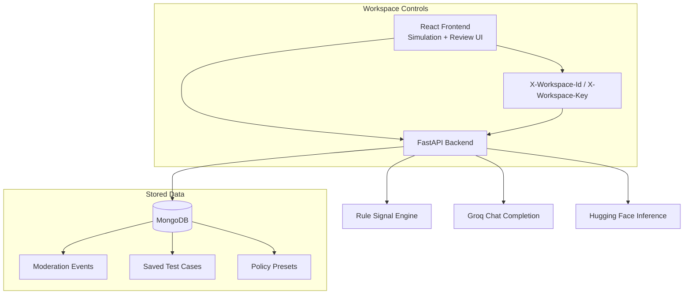

<div align="center">

# Text-Guard

**Hybrid AI + Rule-Based Moderation Workspace for Risky User Text**

<p align="center">
  <strong>Simulation Lab • Review Queue • Policy Presets • Regression Memory</strong>
</p>

<p align="center">
  
  
  
  
  
</p>
</div>

---

## Table of Contents

- [Overview](#overview)
- [Core Features](#core-features)
- [Product Flow](#product-flow)
- [System Architecture](#system-architecture)
- [Moderation Logic](#moderation-logic)
- [Tech Stack](#tech-stack)
- [Repository Structure](#repository-structure)
- [Getting Started](#getting-started)
- [Environment Variables](#environment-variables)
- [API Surface](#api-surface)
- [Workflow Notes](#workflow-notes)
- [Deployment](#deployment)
- [Troubleshooting](#troubleshooting)
- [Author](#author)

---

## Overview

**Text-Guard** is a moderation-focused full-stack workspace for evaluating risky user-generated text before it reaches production systems. It combines:

- a **rule-based signal layer** for direct abuse, spam, threats, coercion, and obfuscated wording,
- an **LLM moderation layer** using **Groq** first and **Hugging Face** as fallback,
- a **review queue** for human follow-up,
- a **saved test-case memory** for regression suites,
- and **workspace-scoped controls** so the same backend can be used across separate environments or tenants.

This project is currently shaped as a **moderation simulation lab** rather than a fully integrated end-user product. That is a deliberate strength: it gives teams a controlled place to tune policies, validate thresholds, preserve edge cases, and rehearse review operations before wiring in real traffic.

> [!IMPORTANT]
> **Current scope:** Text-Guard is a moderation workspace and API foundation. It does not yet include production auth, reviewer role management, or live product ingestion connectors.

---

## Core Features

| Feature | Description |
| --- | --- |
| Hybrid Moderation Engine | Merges deterministic rule signals with LLM category scoring for stronger abuse and evasion detection. |
| Obfuscation Awareness | Detects spaced-out, symbol-swapped, and misspelled abusive language like `k y s` or `1d10t`. |
| Policy-Based Routing | Converts category scores into `allow`, `review`, or `block` outcomes using configurable thresholds. |
| Review Queue | Lets reviewers assign owners, add notes, resolve cases, approve allows, or confirm blocks. |
| Simulation Lab | Provides a frontend workflow to test content, compare policy presets, and submit items to review. |
| Regression Memory | Saves moderation cases and imports or exports them as reusable JSON suites. |
| Analytics Snapshot | Tracks queue status, moderation volume, top categories, top flags, and recent trend data. |
| Workspace Scoping | Uses `X-Workspace-Id` and optional `X-Workspace-Key` headers to isolate data by workspace. |

---

## Product Flow



---

## System Architecture



---

## Moderation Logic

Text-Guard does not rely on a single classifier. The moderation decision is built from two parallel inputs:

### 1. Rule Signals

The backend uses curated regex and canonicalization logic to detect:

- direct slurs and abuse,
- threatening language,
- violent phrasing,
- self-harm references,
- explicit sexual content,
- manipulative scam pressure,
- repeated characters and multi-link spam,
- and obfuscated phrasing through compacted character matching.

### 2. LLM Scoring

The backend then asks an LLM to return JSON-only moderation output with:

- `score`
- `label`
- `matched_seed`
- `categories`

Provider priority is:

1. **Groq** via `GROQ_API_KEY`
2. **Hugging Face Inference API** via `HF_API_TOKEN`
3. **No external model** if neither is configured

### 3. Final Action Selection

Merged category scores are compared against thresholds:

- `score >= BLOCK_THRESHOLD` -> `block`
- `score >= REVIEW_THRESHOLD` -> `review`
- otherwise -> `allow`

Default thresholds from the repo:

- `REVIEW_THRESHOLD=0.45`
- `BLOCK_THRESHOLD=0.85`

---

## Tech Stack

- **Backend:** FastAPI, Uvicorn, Pydantic, python-dotenv
- **Moderation Providers:** Groq, Hugging Face Inference API
- **Persistence:** MongoDB via `pymongo`
- **Frontend:** React 19, React Router 7, Vite
- **UI Utilities:** Framer Motion, Lucide React, clsx, tailwind-merge

---

## Repository Structure

```text
Text-Guard/
├── backend/
│   ├── main.py                  # FastAPI app entrypoint
│   ├── routes.py                # Moderation, review, analytics, policy, and suite APIs
│   ├── providers.py             # Groq/HF provider logic and Mongo persistence helpers
│   ├── rules.py                 # Regex + obfuscation-aware moderation rules
│   ├── config.py                # Environment loading and runtime settings
│   └── requirements.txt         # Python dependencies
├── frontend/
│   ├── src/
│   │   ├── components/          # Header and shared UI primitives
│   │   ├── lib/
│   │   │   └── api.js           # API client with workspace headers
│   │   └── views/
│   │       ├── Home.jsx         # Product overview and analytics dashboard
│   │       ├── SimulationLab.jsx# Moderation simulator and policy workspace
│   │       └── Review.jsx       # Review queue and decision surface
│   ├── .env.example             # Frontend env template
│   └── package.json             # Frontend scripts and dependencies
├── .env.example                 # Root/backend env template
├── Procfile                     # Render-style backend startup command
└── README.md
```

---

## Getting Started

### Prerequisites

- Python 3.10+
- Node.js 18+
- MongoDB instance for persistence features
- Groq API key or Hugging Face token for model moderation

### 1. Clone the Repository

```bash
git clone https://github.com/dheerajpapani/Text-Guard.git
cd Text-Guard
```

### 2. Backend Setup

```bash
cd backend
python -m venv .venv
```

Activate the virtual environment:

```powershell
.venv\Scripts\activate
```

Install dependencies:

```bash
pip install -r requirements.txt
```

Create your environment file in the project root or backend-resolved working directory:

```bash
copy ..\.env.example ..\.env
```

Run the API:

```bash
uvicorn main:app --host 0.0.0.0 --port 8088 --reload
```

### 3. Frontend Setup

Open a second terminal:

```bash
cd frontend
npm install
copy .env.example .env
npm run dev
```

Frontend default local URL:

```text
http://localhost:5173
```

Backend default local URL:

```text
http://localhost:8088
```

---

## Environment Variables

### Backend `.env`

```env
APP_ENV=development
APP_NAME=Text Guard
APP_VERSION=0.1.0
PORT=8088
CORS_ORIGINS=http://localhost:5173,http://127.0.0.1:5173

BLOCK_THRESHOLD=0.85
REVIEW_THRESHOLD=0.45
LOG_ALL_DECISIONS=true
ENABLE_DEBUG_ENV=false
MOCK_MODE=false

GROQ_API_KEY=
GROQ_MODEL=llama-3.1-8b-instant
HF_API_TOKEN=
HF_MODEL=google/flan-t5-small

MONGO_URI=
MONGODB_DB=text_guard
MONGODB_COLLECTION=moderation_events
MONGODB_TEST_CASES_COLLECTION=saved_test_cases
MONGODB_POLICY_COLLECTION=policy_presets

DEFAULT_WORKSPACE_ID=default
WORKSPACE_SHARED_KEY=
```

### Frontend `frontend/.env`

```env
VITE_API_BASE_URL=http://localhost:8088
VITE_WORKSPACE_ID=default
VITE_WORKSPACE_KEY=
```

### Environment Notes

- `MOCK_MODE=true` makes `/moderate` return a safe mock response without real scoring.
- If `WORKSPACE_SHARED_KEY` is set in the backend, the frontend must send the matching `VITE_WORKSPACE_KEY`.
- MongoDB is required for review logs, analytics, test case storage, and policy presets.
- If no model provider key is configured, the system still runs on rules only, but LLM scoring is skipped.

---

## API Surface

### Public / Core

- `GET /` - service metadata
- `GET /health` - health check with provider availability
- `POST /moderate` - moderation decision for input text

### Admin / Workspace Features

- `GET /admin/logs`
- `POST /admin/review-submissions`
- `POST /admin/logs/{event_id}/decision`
- `POST /admin/logs/{event_id}/assign`
- `GET /admin/analytics`
- `GET /admin/test-cases`
- `POST /admin/test-cases`
- `GET /admin/test-cases/export`
- `POST /admin/test-cases/import`
- `GET /admin/policy-presets`
- `POST /admin/policy-presets`

### Example Moderation Request

```bash
curl -X POST http://localhost:8088/moderate ^
  -H "Content-Type: application/json" ^
  -H "X-Workspace-Id: default" ^
  -d "{\"text\":\"k y s you 1d10t\",\"mode\":\"comment\"}"
```

Example response shape:

```json
{
  "action": "block",
  "score": 0.92,
  "reason": "policy_harassment",
  "matched_seed": "kys",
  "categories": {
    "hate": 0.0,
    "harassment": 0.92,
    "sexual": 0.0,
    "violence": 0.0,
    "self_harm": 0.0,
    "spam": 0.0,
    "other": 0.0
  },
  "flags": ["obfuscated_threat"],
  "policy": {
    "block_threshold": 0.85,
    "review_threshold": 0.45
  },
  "provider": "groq",
  "model": "llama-3.1-8b-instant",
  "mode": "comment",
  "latency_ms": 123
}
```

---

## Workflow Notes

### Frontend Views

- **Simulation Lab**: analyze text, compare against policy presets, save cases, import/export suites, and submit items to review.
- **Review Queue**: filter by action or status, assign ownership, record reviewer notes, and apply final decisions.
- **Overview Dashboard**: inspect queue analytics, top flags, top categories, and recent event trend.

### Policy Presets

Policy presets are stored in MongoDB and can be edited from the frontend. The UI currently ships with default preset ideas such as:

- `balanced`
- `strict`

### Workspace Isolation

All frontend requests attach:

- `X-Workspace-Id`
- `X-Workspace-Key` when configured

This makes it possible to reuse one backend for multiple workspace contexts with isolated stored documents.

---

## Deployment

The repo already includes a `Procfile` for backend deployment:

```text
web: cd backend && uvicorn main:app --host 0.0.0.0 --port ${PORT:-8088}
```

This is suitable for Render-style Python web deployment. For a typical split deployment:

- deploy the **backend** as a FastAPI service,
- deploy the **frontend** as a static Vite app,
- set `VITE_API_BASE_URL` to the public backend URL,
- and configure matching workspace credentials if you enable `WORKSPACE_SHARED_KEY`.

---

## Troubleshooting

<details>
<summary><strong>The frontend loads, but review logs or analytics fail</strong></summary>

MongoDB is not optional for persistence features. Without `MONGO_URI`, moderation can still return responses, but log retrieval, analytics, saved cases, and policy preset storage will fail.
</details>

<details>
<summary><strong>Moderation works, but provider shows as <code>none</code> or <code>error</code></strong></summary>

Check `GROQ_API_KEY` or `HF_API_TOKEN`. If Groq is unavailable, the backend attempts Hugging Face. If neither is configured, the API falls back to rule-only behavior.
</details>

<details>
<summary><strong>Workspace requests return 401</strong></summary>

If `WORKSPACE_SHARED_KEY` is configured on the backend, the frontend or client must send the exact same value in `X-Workspace-Key` or `VITE_WORKSPACE_KEY`.
</details>

<details>
<summary><strong>The API says CORS is blocked locally</strong></summary>

Ensure `CORS_ORIGINS` includes the frontend origin, usually `http://localhost:5173` and `http://127.0.0.1:5173`.
</details>

---

## Author

Developed and maintained by **Dheeraj Papani**.

<a href="https://github.com/dheerajpapani">
  
</a>
<a href="https://www.linkedin.com/in/dheerajpapani">
  
</a>
